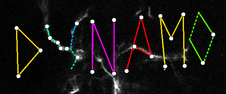

# pyDynamo


Application for the UI and analysis of neurons via **Dyna**mic **Mo**rphometrics.

## Installation

This library can be installed using [uv](https://docs.astral.sh/uv/). If you don't have uv, install it first:
```
curl -LsSf https://astral.sh/uv/install.sh | sh
```

Then create an environment and install:
```
uv venv --python 3.10 dynamoEnv
source dynamoEnv/bin/activate
uv pip install --upgrade -e "git+https://github.com/ubcbraincircuits/pyDynamo#egg=pydynamo_brain&subdirectory=pydynamo_brain"
uv pip install pyNeuroTrace
```

> **Note for GPU users:** uv installs the CPU-only build of PyTorch by default. To use a CUDA-enabled build, install torch manually before the above, e.g. for CUDA 12.1:
> ```
> uv pip install torch torchvision --extra-index-url https://download.pytorch.org/whl/cu121
> ```

Once installed, it can be run by the following command, and optionally given a file to open:
```
pydynamo_brain
```
or
```
pydynamo_brain path/to/my/file.dyn.gz
```

## Usage
Documentation is available at https://ubcbraincircuits.github.io/pyDynamo/ . For an overview:

After opening Dynamo, two windows will show.
1)  One will contain the dynamo logo (see above), and a close button. This window should always stay open until you want to stop - then pressing the button will close dynamo completely.
2) The other will give three options:
    * *New from Stack(s)* (Ctrl-N) will let you create a new dynamo project by opening one or more unlabelled 3D .tif files, containing the neuron volumes. This can then be saved via Ctrl-S to a .dyn.gz file
    * *Open from File* (Ctrl-O) is used to re-open an existing dynamo project from a .dyn.gz file.
    * *Import from Matlab .mat* (Ctrl-I) will attempt to load dynamo data created using the old matlab version.

Once stacks are loaded, see the help dialog (F1) for all the commands available.

The recommended approach is:
1) Load the first .tif stack in the series
2) Draw the full dendritic arbor (if you save early, it'll start auto-saving too)
3) Load the next .tif stack in the series
4) Generate points in this new stack, from either
    * Importing from the previous drawing (I)
    * Importing from an SWC file (**coming**)
5) Move/add/delete points as required to match the stack images.
6) Register (R) to make sure that old points are mapped to new points correctly.
7) Repeat from step 3 until all stacks are done.

## Analysis
Currently analysis is done purely visually (i.e. 'M' or '3'), but as requirements on getting data out are clearer, there'll be a way added to export per-stack and per-branch metrics to a csv (or similar).

## Errors
As pyDynamo is currently pre-release and under active development, it may also still crash occasionally.
If this happens, let me know and I should be able to fix it - more error details should also be visible from the commandline in which the original `python dynamo.py` was run.

## Acknowledgement & Referencing
Development of pyDynamo is supported by funding from a Canadian Institutes of Health Research (CIHR)
Foundation Award (FDN-148468) and the [Canadian Open Neuroscience Platform](https://conp.ca/).
pyDynamo has the research resource identifier [RRID: SCR_017541](https://scicrunch.org/resources/Any/search?q=SCR_017541&l=SCR_017541)


