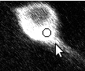
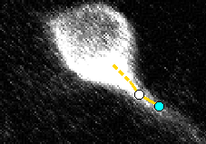

Drawing
================

First, click anywhere to add the initial point to your stack. This should be placed at the soma.

Next, you can click into empty space to continue the current branch into that area.
Make sure to also change Z-stack (scroll-wheel, or buttons 1 & 2) to place it in the right spot.

New branches can be made by selecting the branch point, then right-clicking the new position,
or clicking while holding Ctrl:

.. container:: img-inline

  .. figure:: ../img/selectPoint.png

    First select a point...

  .. figure:: ../img/newBranch.png

    ...then Right/Ctrl-click to create a point on a new branch

Similarly, new points can be added mid-branch by first selecting a neighboring point on that branch,
then middle-clicking the new position, or clicking while holding Shift:

.. container:: img-inline

  .. figure:: ../img/selectPoint.png

    First select a point...

  .. figure:: ../img/midBranch.png

    ...then Middle/Shift-click to create a point mid-branch

Moving
------

To move a point, first middle-click (or shift-click) a point, which will turn it red. Next, click
on the new location to move it to. If you want to move all downstream points, hold shift at the same time.

.. container:: img-inline

  .. figure:: ../img/movePoint1.png

    Shift-click to begin moving...

  .. figure:: ../img/movePoint2.png

    ...then click to move, optionally holding shift to move others.

Reparenting
-----------

If a point is attached to the wrong parent, this can be fixed. First, select the point, then press
Ctrl-R to start the reparenting, which will turn it blue. Next, click the new parent.

.. container:: img-inline

  .. figure:: ../img/reparent1.png

    Shift-click to begin moving...

  .. figure:: ../img/reparent2.png

    ...then click to move, optionally holding shift to move others.

Landmarking
-----------

TODO: Ignore this feature for now.

Other
-------

Multiple other drawing options are available through key commands.
These are all listed in a help dialog (shortcut F1), and includes:

* W/A/S/D to pan around the image
* 1/2 to change current Z stack
* X/Z to zoom in and out
* 4/5 to change lower brightness limits, 7/8 to change upper, and 6 to reset.
* C to change displayed channel. Shift-C to use color to draw the image.
* F to toggle showing annotations / IDs / nothing
* V to toggle showing branches away from the current Z stack.
* H to toggle showing hilights.
* J to rotate through different line thicknesses.
